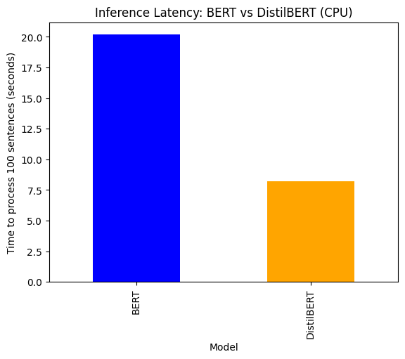

# Multi-Dimensional Audit of Transformer Models: Efficiency, Gender, and Geopolitical Bias

## Abstract
Large Language Models (LLMs) are increasingly deployed in real-world applications, yet their performance trade-offs and inherent societal biases remain critical areas of study. This research project conducts a comprehensive audit of the `bert-base-uncased` architecture. The study is threefold: (1) Benchmarking inference latency against distilled models (`DistilBERT`) on CPU hardware, (2) Quantifying occupational gender bias using Masked Language Modeling (MLM), and (3) Analyzing geopolitical stereotypes in high-skill vs. low-skill professions.

## Key Findings

### 1. Efficiency Benchmarking (Inference Latency)
To evaluate feasibility for edge deployment, I compared the inference time of `BERT` vs. `DistilBERT` over 100 iterations on a standard CPU environment.
* **Result:** `DistilBERT` achieved a **2.46x speedup** (8.19s vs 20.19s) compared to the baseline.
* **Implication:** Knowledge distillation significantly reduces computational cost with minimal architectural changes, validating its use for latency-sensitive applications.

*(Note: Replace this path with your actual image filename)*

### 2. Gender Bias Quantification
Using a probing pipeline, I evaluated the model's probability distribution for gendered pronouns ("He" vs. "She") across various professions.
* **Observation:** The model exhibits severe skew.
    * **Nurse:** ~90% probability assigned to "She".
    * **Engineer / CEO:** >80% probability assigned to "He".
* **Implication:** Deployment of vanilla BERT models in automated hiring pipelines carries a high risk of amplifying existing gender disparities.

### 3. Geopolitical & Nationality Bias (The "Polarization Effect")
I extended the audit to test nationality bias, specifically comparing associations between "India" and "America" for varying job roles.
* **Observation:** The model displayed a complex, non-linear bias.
    * **High-Skill (CEO):** India was associated with "CEO" at a **10x higher probability** than America ($p=0.022$ vs $p=0.002$).
    * **Service (Assistant):** India was simultaneously associated with "Assistant" at a **4x higher probability**.
* **Conclusion:** The model stereotypes specific demographics as sources for both executive leadership and outsourced labor, reflecting biases present in the training corpora (e.g., Wikipedia, News).

## Methodology & Tools
* **Frameworks:** PyTorch, Hugging Face Transformers.
* **Analysis:** Pandas for data structuring, Matplotlib for visualization.
* **Technique:** Masked Language Modeling (MLM) for bias probing; Knowledge Distillation benchmarking for efficiency.

## How to Run
1.  Clone the repository.
2.  Install dependencies: `pip install transformers torch pandas matplotlib`.
3.  Run the notebook `Transformer_Efficiency_Fairness_Analysis.ipynb`.
